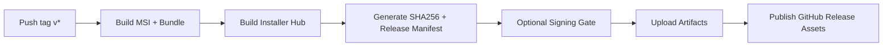

# 🎓 EvaluaPro Sistema Universitario

Plataforma MERN para evaluacion universitaria: generacion de examenes PDF, vinculacion por QR, analisis OMR, calificacion asistida y operacion local/cloud.

> Estado documental actualizado: **2026-02-27**

## 🚀 Vision del producto
EvaluaPro unifica en un solo flujo el ciclo docente completo:
- diseno y generacion de examenes,
- captura y lectura OMR,
- calificacion y reportes,
- sincronizacion entre equipos y portal alumno.

## ✨ Ventajas clave
- 🧩 **Flujo integral**: de la creacion del examen a la publicacion de resultados.
- 🧠 **OMR contractual**: validaciones sinteticas y reales con gates bloqueantes.
- 🔒 **Integridad de instalacion**: artefactos con `SHA-256` y verificaciones automáticas.
- 🛠️ **Installer Hub online**: instalar, reparar o desinstalar desde una misma GUI.
- 🔄 **Canal estable por defecto**: el actualizador interno consume `stable`.
- 📊 **Evidencia auditable**: trazabilidad en `reports/qa`, `docs` y gates CI.

## ⚖️ Licenciamiento
- Open Core: `AGPL-3.0-or-later` (`LICENSE`).
- Licencia comercial propietaria: `LICENSE-COMMERCIAL.md`.
- Avisos y contribución: `NOTICE.md`, `CONTRIBUTING.md`.

## 🛡️ Privacidad y cumplimiento
- Política de seguridad: `docs/SECURITY_POLICY.md`.
- Aviso de privacidad: `docs/legal/aviso-privacidad-integral.md`.
- Procedimiento ARCO: `docs/legal/procedimiento-arco.md`.
- Anexo sector público Hidalgo: `docs/legal/anexo-sector-publico-hidalgo.md`.
- Hooks locales de higiene (opcional): `npm run compliance:hooks:install`.

## 📦 Ultima version publicada
Datos al **27 de febrero de 2026**:

| Campo | Valor |
| --- | --- |
| Version | `v1.0.0-beta.0` |
| Publicacion | `2026-02-27T06:21:18Z` |
| Release | [GitHub Releases - v1.0.0-beta.0](https://github.com/Dtcsrni/EvaluaPro_Sistema_Universitario/releases/tag/v1.0.0-beta.0) |
| Assets clave | `EvaluaPro-InstallerHub.exe`, `EvaluaPro.msi`, `EvaluaPro.msi.sha256`, `EvaluaPro-release-manifest.json` |
| Canal en manifiesto | `stable` |

## 🧭 Workflow docente desde cero (Windows)
### 1) Descarga e inicio
1. Ir a [Releases](https://github.com/Dtcsrni/EvaluaPro_Sistema_Universitario/releases).
2. Descargar `EvaluaPro-InstallerHub.exe`.
3. Ejecutar con permisos de administrador (UAC).

### 2) Wizard Installer Hub
1. **Splash introductorio** con branding y acceso al asistente.
2. Deteccion automatica de modo: **Instalar / Reparar / Desinstalar**.
3. Analisis de requisitos: SO, arquitectura, disco, internet, Node.js, Docker Desktop.
4. Seleccion de carpeta destino y resumen de recursos.
5. Autoinstalacion de prerequisitos faltantes (fuentes oficiales + checksum).
6. Resolucion de ultima release estable y descarga de `EvaluaPro.msi`.
7. Verificacion de hash SHA-256 del MSI.
8. Ejecucion de `msiexec` (install/repair/uninstall) con progreso por fases.
9. Verificacion post-instalacion de modulos criticos.
10. Pantalla final con acciones: abrir dashboard, ver logs, reintentar, finalizar.

### 3) Politica de desinstalacion
- Por defecto: **conserva datos** del usuario.
- Opcion avanzada: **limpieza total** con confirmacion explicita.

## 🏗️ Arquitectura tecnica (resumen)
### Monorepo
- `apps/backend`: API docente (Express + TypeScript + MongoDB).
- `apps/frontend`: interfaz web docente/alumno (React + Vite + TypeScript).
- `apps/portal_alumno_cloud`: API + portal de alumno.

### Installer Hub (Windows)
- Entrada GUI: `scripts/installer-hub/InstallerHub.ps1`
- Modulos internos:
  - `ReleaseResolver`
  - `PrereqDetector`
  - `PrereqInstaller`
  - `ProductInstaller`
  - `PostInstallVerifier`

Documentacion tecnica: [docs/INSTALLER_HUB.md](docs/INSTALLER_HUB.md)

## ⚙️ Requisitos de desarrollo
- Node.js `>= 24`
- npm
- Docker Desktop (recomendado)
- Toolchain nativo para modulos Node en Windows:
  - Visual Studio Build Tools
  - CMake
  - Python 3

## ▶️ Arranque rapido local
```bash
npm install
npm run dev:backend
npm run dev:frontend
```

Portal opcional:
```bash
npm run dev:portal
```

## 🧪 Calidad y gates
Comandos de control recomendados:
```bash
npm run lint
npm run typecheck
npm run test:update
npm run test:installer-hub:contract
npm run test:wix:policy
npm run pipeline:contract:check
npm run qa:clean-architecture:strict
```

## 🔄 Pipeline y releases
### Contrato de assets por release
- `EvaluaPro.msi`
- `EvaluaPro.msi.sha256`
- `EvaluaPro-InstallerHub.exe`
- `EvaluaPro-InstallerHub.exe.sha256`
- `EvaluaPro-release-manifest.json`

### Reglas de publicacion
- Tags `v*` publican assets automaticamente.
- Tags que contienen `alpha`, `beta` o `rc` se marcan como **pre-release**.
- Releases sin esos sufijos se publican como estables y `latest`.
- Si no hay certificado de firma, se publica `SIGNING-NOT-PRODUCTION.txt`.

### Flujo CI de instalador


## 🗺️ Roadmap
Objetivo: pasar de beta operativa a release estable auditada.

1. **Consolidacion de contratos**
   API canonica `/api/*`, OMR/PDF contractuales, sync contractual.
2. **Cierre de calidad automatizada**
   QA full, perf tecnico y perf de negocio, evidencia verificable.
3. **Promocion a estable**
   corridas CI consecutivas en verde + validacion humana en produccion-like.

Roadmap detallado: [docs/ROADMAP_REQUISITOS.md](docs/ROADMAP_REQUISITOS.md)

## 📚 Documentacion clave
- [docs/README.md](docs/README.md)
- [docs/INSTALLER_HUB.md](docs/INSTALLER_HUB.md)
- [docs/ENGINEERING_BASELINE.md](docs/ENGINEERING_BASELINE.md)
- [docs/RELEASE_GATE_STABLE.md](docs/RELEASE_GATE_STABLE.md)
- [docs/OMR_GATE_RUNBOOK.md](docs/OMR_GATE_RUNBOOK.md)
- [CHANGELOG.md](CHANGELOG.md)

## 👨‍🏫 Enfoque docente
Este repositorio prioriza confiabilidad operativa para docentes:
- instalacion guiada desde cero,
- recuperacion por reparacion,
- desinstalacion controlada,
- soporte basado en logs y evidencias reproducibles.

