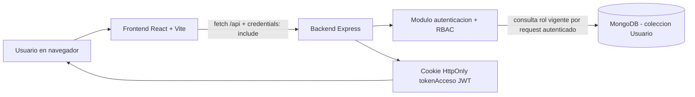
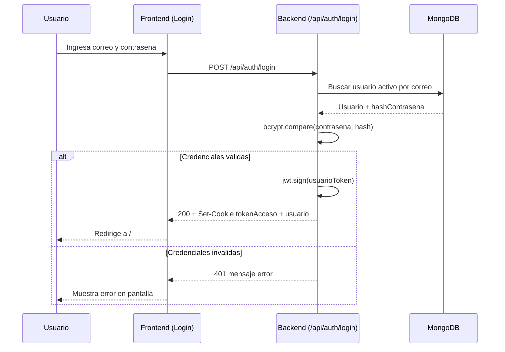
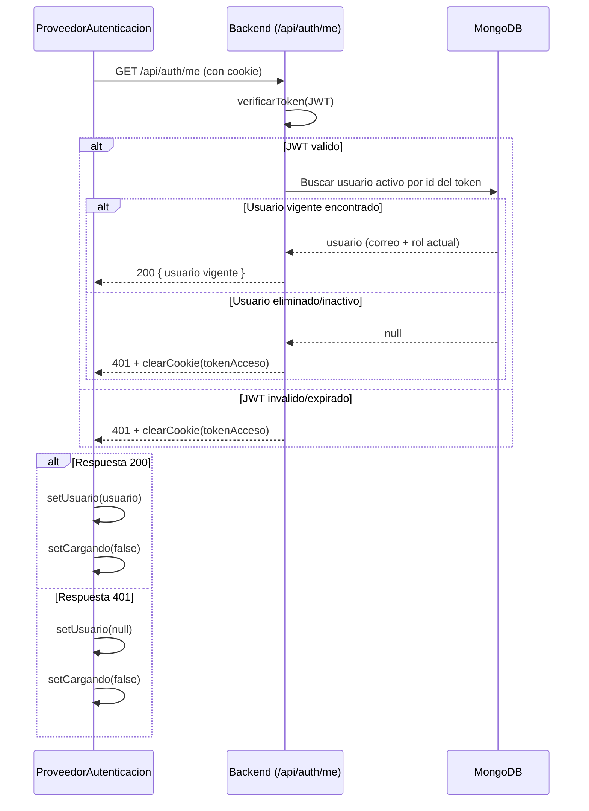
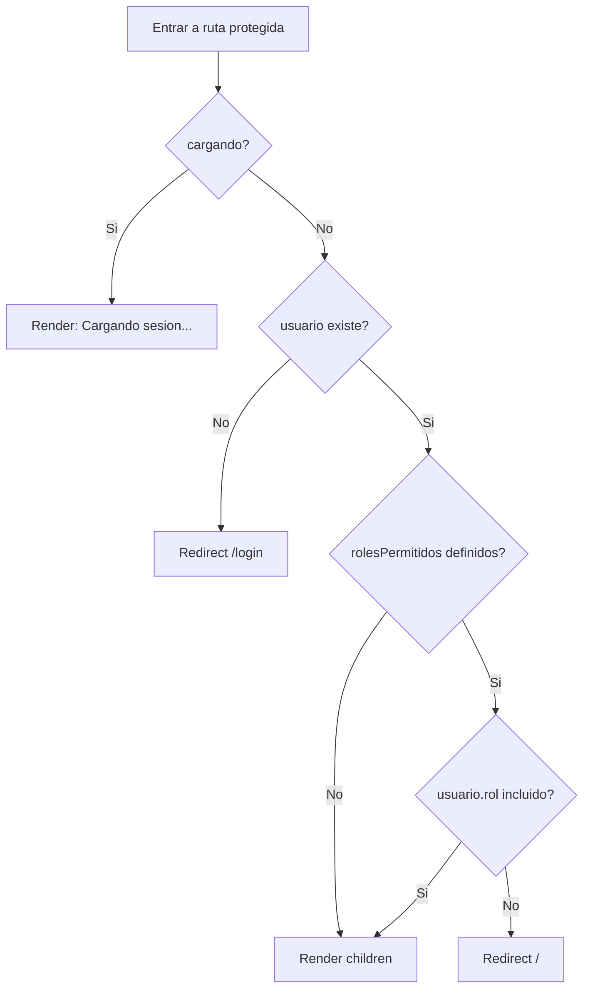
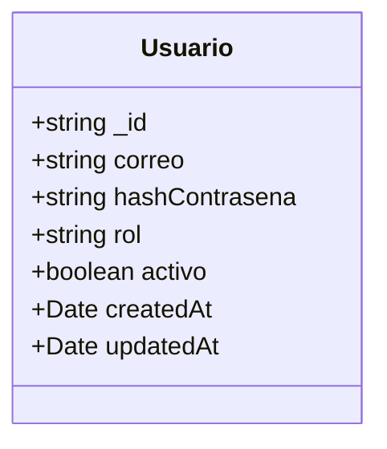
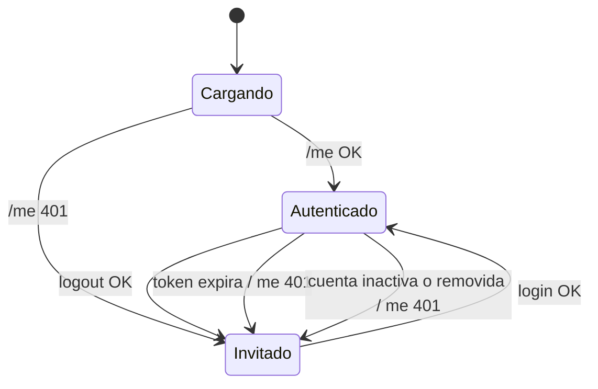
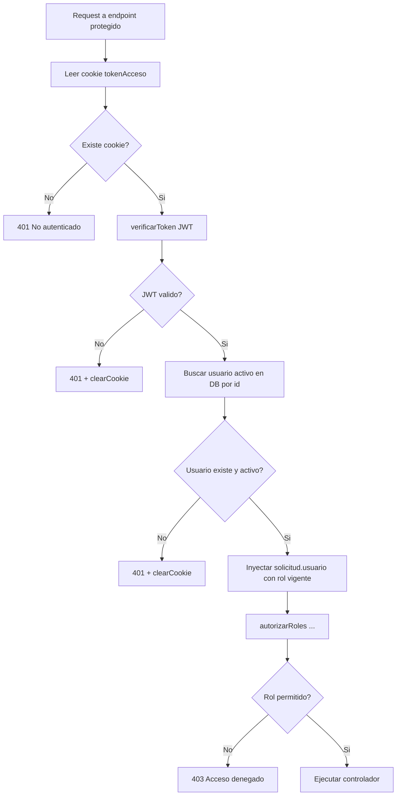

## [BLOQUE DIDACTICO] docs/DIAGRAMAS_FUNCIONAMIENTO.md
- Que es: Documento de apoyo con diagramas del flujo funcional.
- Que hace: Describe visualmente procesos clave de autenticacion y autorizacion.
- Como lo hace: Usa secciones y diagramas para explicar interacciones frontend-backend-DB.

# Diagramas de Funcionamiento (login-react-mern)

Este documento resume el flujo principal del proyecto con diagramas Mermaid.

## 1) Arquitectura general

## 2) Flujo de inicio de sesion

## 3) Flujo de restauracion de sesion al cargar la app

## 4) Logica de RutaProtegida

## 5) Modelo de datos de usuario

## 6) Maquina de estados de sesion en frontend

## 7) RBAC estricta en middleware (KISS)

## 8) Diagramas renderizados (SVG)

- Arquitectura general: `docs/diagramas/render/diagrama-01.svg`
- Flujo inicio de sesion: `docs/diagramas/render/diagrama-02.svg`
- Restauracion de sesion: `docs/diagramas/render/diagrama-03.svg`
- Logica de RutaProtegida: `docs/diagramas/render/diagrama-04.svg`
- Modelo de datos Usuario: `docs/diagramas/render/diagrama-05.svg`
- Maquina de estados de sesion: `docs/diagramas/render/diagrama-06.svg`
- RBAC estricta middleware: `docs/diagramas/render/diagrama-07.svg`

