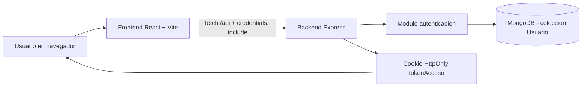
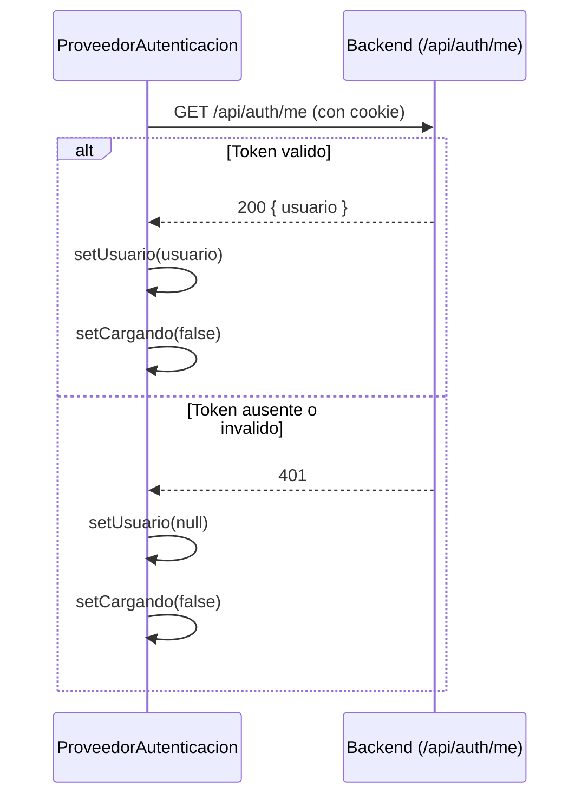
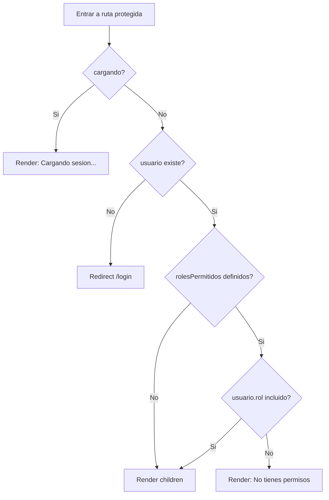
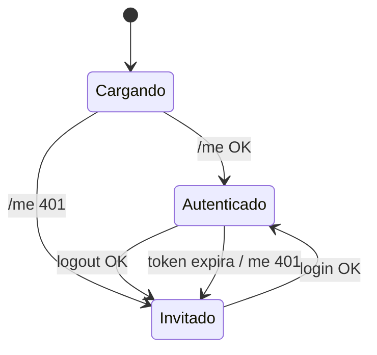

## [BLOQUE DIDACTICO] docs/DIAGRAMAS_FUNCIONAMIENTO.md
- Que es: Documento de apoyo con diagramas del flujo funcional.
- Que hace: Describe visualmente procesos clave de autenticacion y autorizacion.
- Como lo hace: Usa secciones y diagramas para explicar interacciones frontend-backend-DB.

# Diagramas de Funcionamiento (login-react-mern)

Este documento resume el flujo principal del proyecto con diagramas Mermaid.

## 1) Arquitectura general

## 2) Flujo de inicio de sesion

## 3) Flujo de restauracion de sesion al cargar la app

## 4) Logica de RutaProtegida

## 5) Modelo de datos de usuario

## 6) Maquina de estados de sesion en frontend

