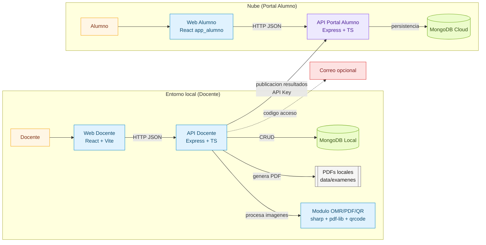
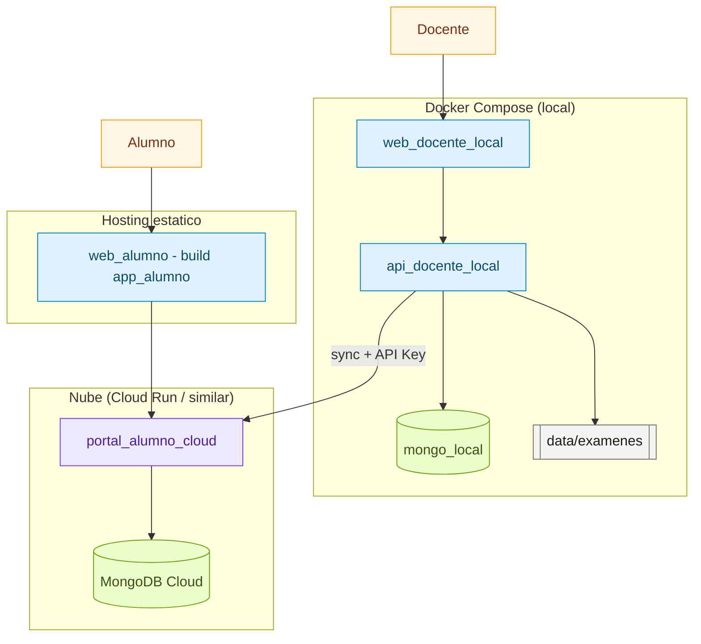

# Arquitectura

## Resumen
La plataforma se divide en dos piezas:
1) Backend y frontend docente local (monolito modular).
2) Servicio cloud separado para portal alumno (solo lectura).

## Componentes principales
- Backend docente: Express + MongoDB + TypeScript.
- Frontend docente/alumno: React + Vite + TypeScript.
- Cloud Run: servicio portal alumno (API lectura + UI app_alumno).

## Capas del backend
- `modulos/`: dominio de negocio (alumnos, banco, PDF, OMR, calificacion, etc.).
- `infraestructura/`: adaptadores externos (DB, archivos, correo).
- `compartido/`: errores, validaciones, tipos y utilidades.

## Diagrama de arquitectura (logico)

## Diagrama de despliegue (local + nube)

Ver todos los diagramas en `docs/DIAGRAMAS.md`.

Ver la version C4 en `docs/ARQUITECTURA_C4.md`.

## Decisiones clave
- Monolito modular local: menos complejidad, facil mantenimiento.
- Servicio cloud separado: alta disponibilidad para alumno sin exponer red local.
- Calificacion exacta: Decimal.js y fraccion almacenada.
- PDF carta: baja tinta, margenes seguros y QR en cada pagina.
- PDFs locales se almacenan en `data/examenes` (ignorado por git).
- Autenticacion docente con JWT y validacion por objeto.
- Portal alumno con codigo de acceso temporal (12h, 1 uso).
- OMR guiado por mapa de posiciones generado junto al PDF.
- Sincronizacion local -> cloud protegida por API key.

## Nomenclatura
- Rutas, variables y modulos en espanol mexicano con camelCase.
- Colecciones en plural (docentes, alumnos, etc.).
