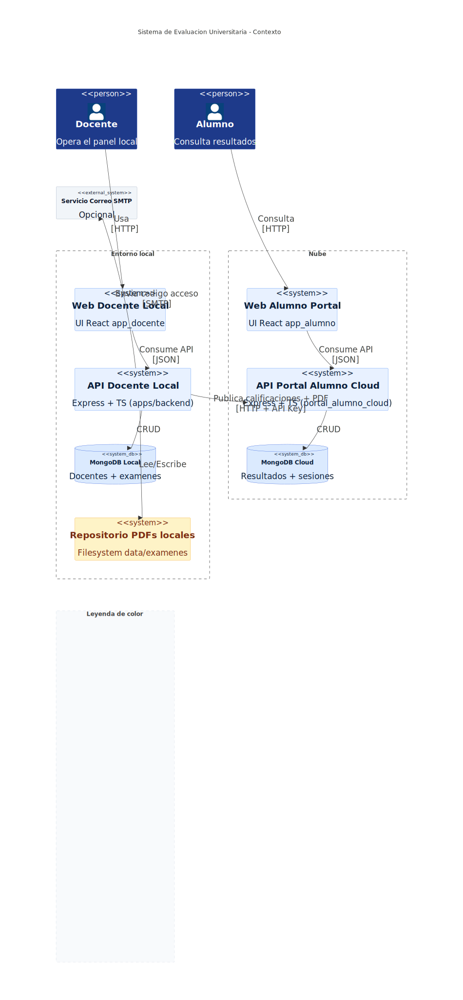
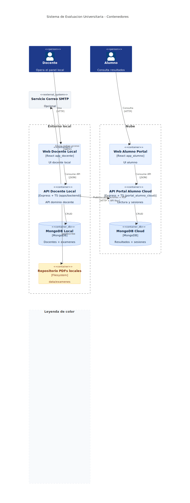
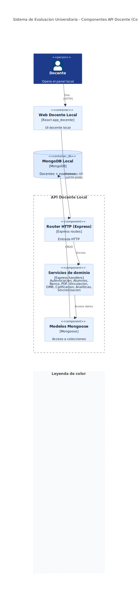
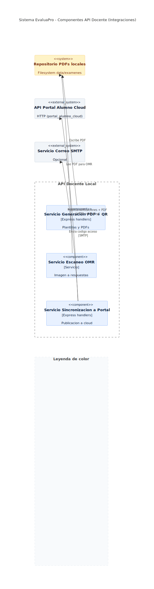

# Arquitectura C4

Documenta el sistema desde 4 vistas C4 ya renderizadas.

## 1. Contexto
Fuente Mermaid: `docs/diagramas/src/c4/arquitectura-c4-context.mmd`

## 2. Contenedores
Fuente Mermaid: `docs/diagramas/src/c4/arquitectura-c4-container.mmd`

## 3. Componentes API docente (core)
Fuente Mermaid: `docs/diagramas/src/c4/arquitectura-c4-component.mmd`

## 4. Componentes API docente (integraciones)
Fuente Mermaid: `docs/diagramas/src/c4/arquitectura-c4-component-integraciones.mmd`

## Observaciones de estado actual
- El backend docente sigue siendo la fuente primaria operativa.
- El portal cloud es read-model sincronizado.
- OMR y calificacion automatica forman parte del core operativo del backend.
- RBAC se aplica en backend; frontend solo refleja permisos disponibles.
