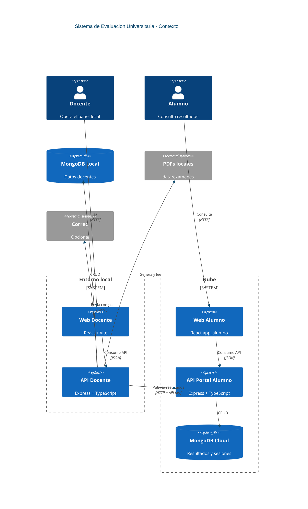
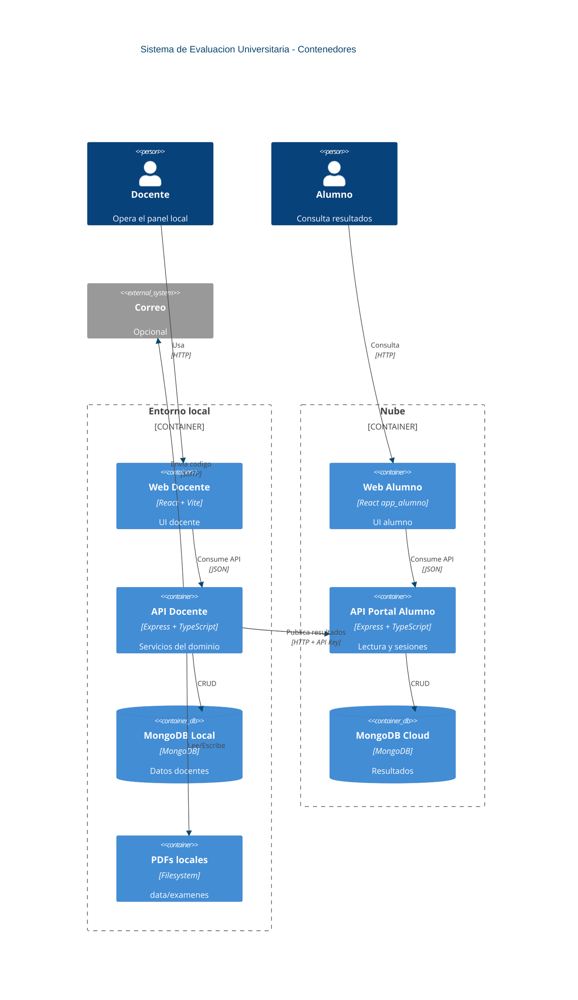

# Arquitectura C4

## Contexto

```mermaid
%%{init: {'theme':'base','themeVariables':{ 'primaryColor':'#e0f2fe', 'primaryTextColor':'#0c4a6e', 'primaryBorderColor':'#0284c7', 'lineColor':'#334155' }}}%%
C4Context
title Sistema de Evaluacion Universitaria - Contexto

Person(docente, "Docente", "Opera el panel local")
Person(alumno, "Alumno", "Consulta resultados")
System_Boundary(local, "Entorno local") {
  System(webDoc, "Web Docente", "React + Vite")
  System(apiDoc, "API Docente", "Express + TypeScript")
}
System_Boundary(cloud, "Nube") {
  System(webAlu, "Web Alumno", "React app_alumno")
  System(apiPortal, "API Portal Alumno", "Express + TypeScript")
  SystemDb(mongoCloud, "MongoDB Cloud", "Resultados y sesiones")
}
SystemDb(mongoLocal, "MongoDB Local", "Datos docentes")
System_Ext(pdfStore, "PDFs locales", "data/examenes")
System_Ext(mail, "Correo", "Opcional")

Rel(docente, webDoc, "Usa", "HTTP")
Rel(webDoc, apiDoc, "Consume API", "JSON")
Rel(apiDoc, mongoLocal, "CRUD")
Rel(apiDoc, pdfStore, "Genera y lee")
Rel(apiDoc, mail, "Envia codigo", "SMTP")
Rel(apiDoc, apiPortal, "Publica resultados", "HTTP + API Key")
Rel(alumno, webAlu, "Consulta", "HTTP")
Rel(webAlu, apiPortal, "Consume API", "JSON")
Rel(apiPortal, mongoCloud, "CRUD")
```

## Contenedores

```mermaid
%%{init: {'theme':'base','themeVariables':{ 'primaryColor':'#e0f2fe', 'primaryTextColor':'#0c4a6e', 'primaryBorderColor':'#0284c7', 'lineColor':'#334155' }}}%%
C4Container
title Sistema de Evaluacion Universitaria - Contenedores

Person(docente, "Docente", "Opera el panel local")
Person(alumno, "Alumno", "Consulta resultados")

Container_Boundary(local, "Entorno local") {
  Container(webDoc, "Web Docente", "React + Vite", "UI docente")
  Container(apiDoc, "API Docente", "Express + TypeScript", "Servicios del dominio")
  ContainerDb(mongoLocal, "MongoDB Local", "MongoDB", "Datos docentes")
  Container(pdfStore, "PDFs locales", "Filesystem", "data/examenes")
}

Container_Boundary(cloud, "Nube") {
  Container(webAlu, "Web Alumno", "React app_alumno", "UI alumno")
  Container(apiPortal, "API Portal Alumno", "Express + TypeScript", "Lectura y sesiones")
  ContainerDb(mongoCloud, "MongoDB Cloud", "MongoDB", "Resultados")
}

System_Ext(mail, "Correo", "Opcional")

Rel(docente, webDoc, "Usa", "HTTP")
Rel(webDoc, apiDoc, "Consume API", "JSON")
Rel(apiDoc, mongoLocal, "CRUD")
Rel(apiDoc, pdfStore, "Lee/Escribe")
Rel(apiDoc, mail, "Envia codigo", "SMTP")
Rel(apiDoc, apiPortal, "Publica resultados", "HTTP + API Key")
Rel(alumno, webAlu, "Consulta", "HTTP")
Rel(webAlu, apiPortal, "Consume API", "JSON")
Rel(apiPortal, mongoCloud, "CRUD")
```