# Diagramas

Este catalogo incluye los diagramas necesarios para entender el sistema end-to-end.

## Arquitectura general



## C4 (contexto, contenedores, componentes)

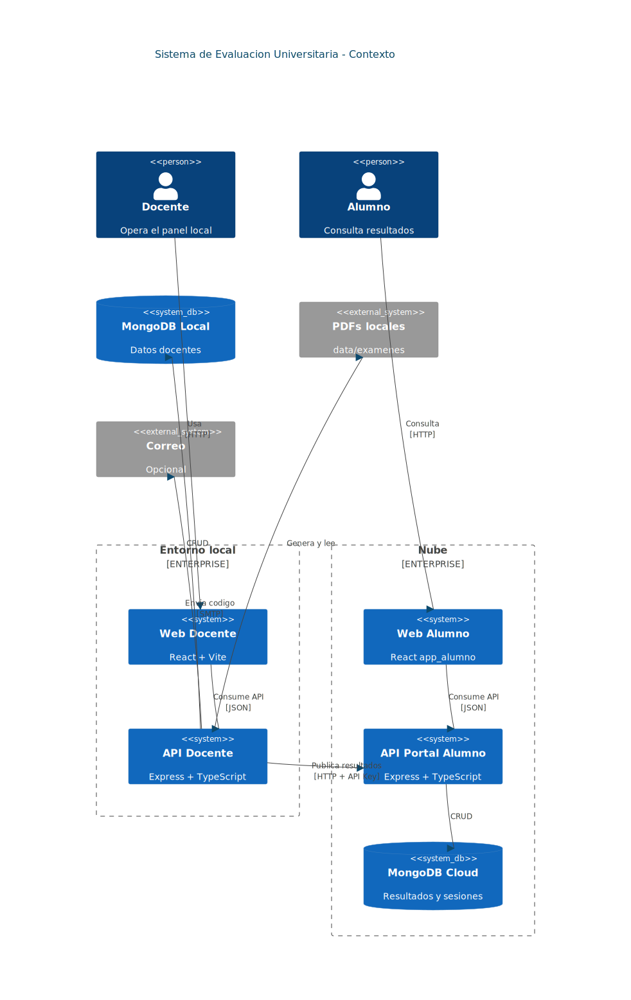

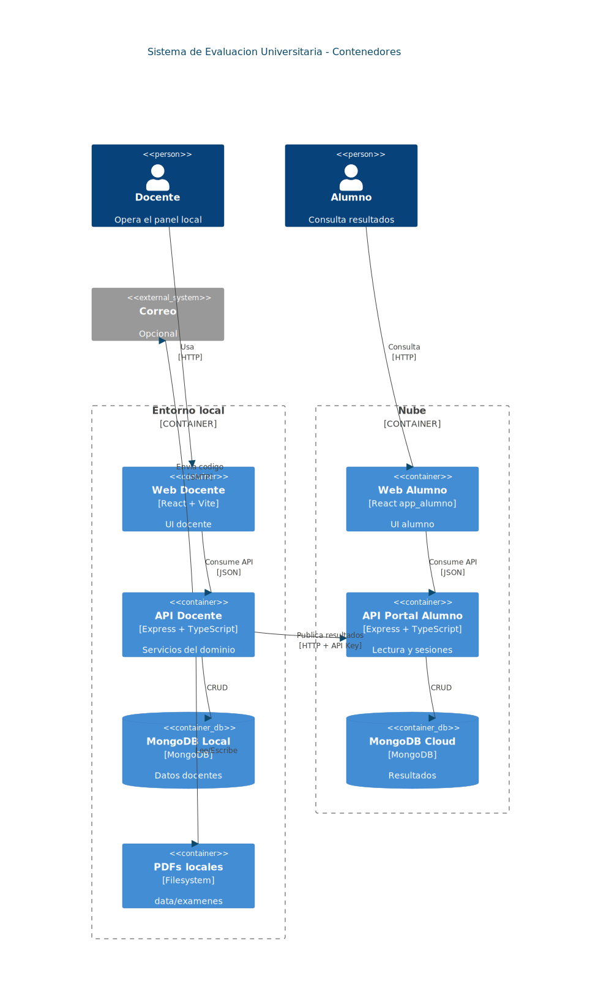

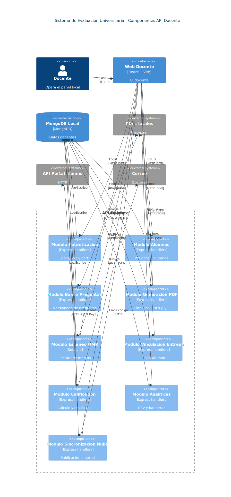

## Flujos principales


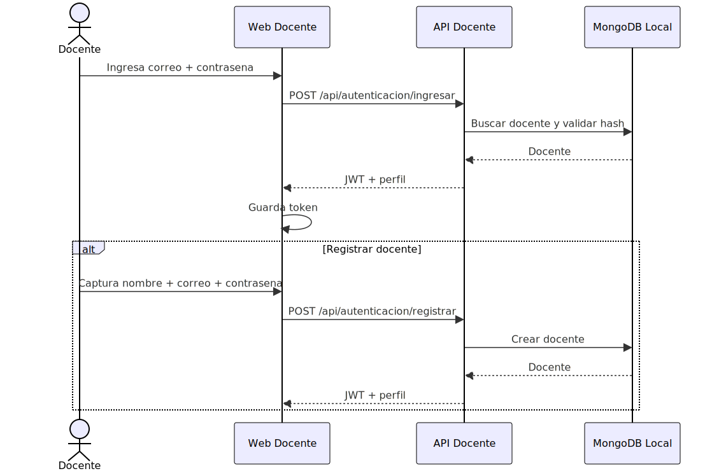

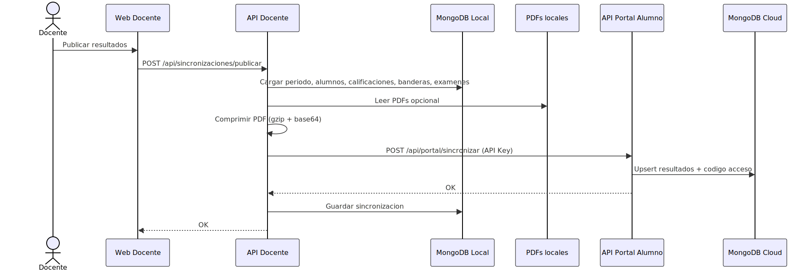

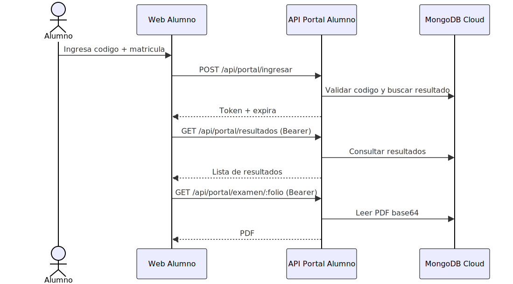

## Modelo de datos

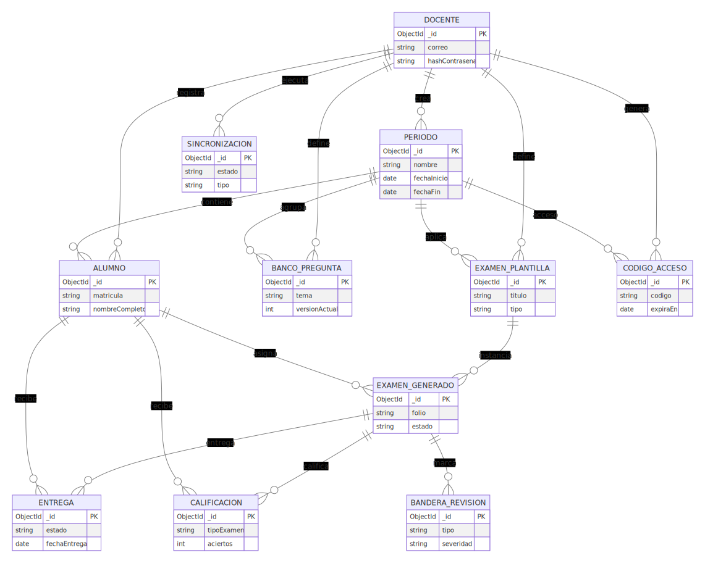

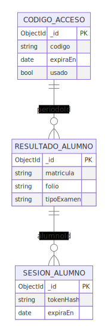

## Fuentes Mermaid
- `docs/diagramas/arquitectura-logica.mmd`
- `docs/diagramas/arquitectura-despliegue.mmd`
- `docs/diagramas/arquitectura-c4-context.mmd`
- `docs/diagramas/arquitectura-c4-container.mmd`
- `docs/diagramas/arquitectura-c4-component.mmd`
- `docs/diagramas/flujo-examen.mmd`
- `docs/diagramas/secuencia-login-docente.mmd`
- `docs/diagramas/secuencia-publicacion.mmd`
- `docs/diagramas/secuencia-portal-alumno.mmd`
- `docs/diagramas/er-local.mmd`
- `docs/diagramas/er-cloud.mmd`