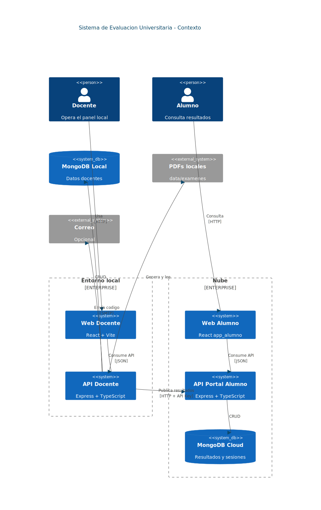
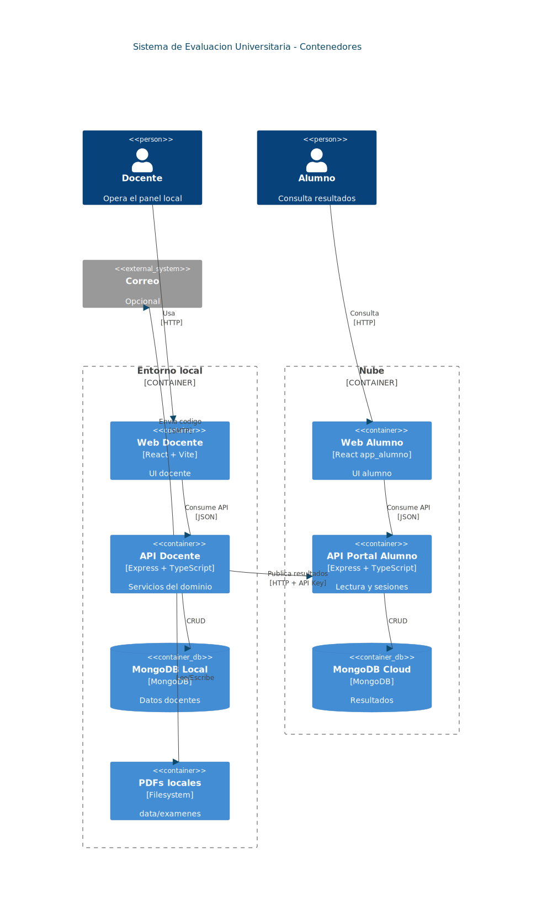
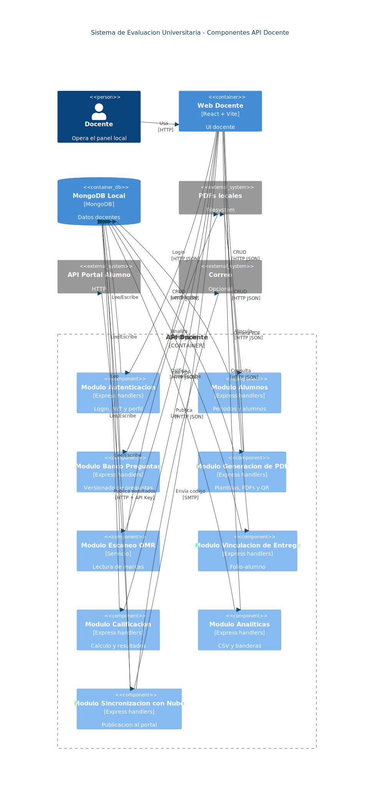
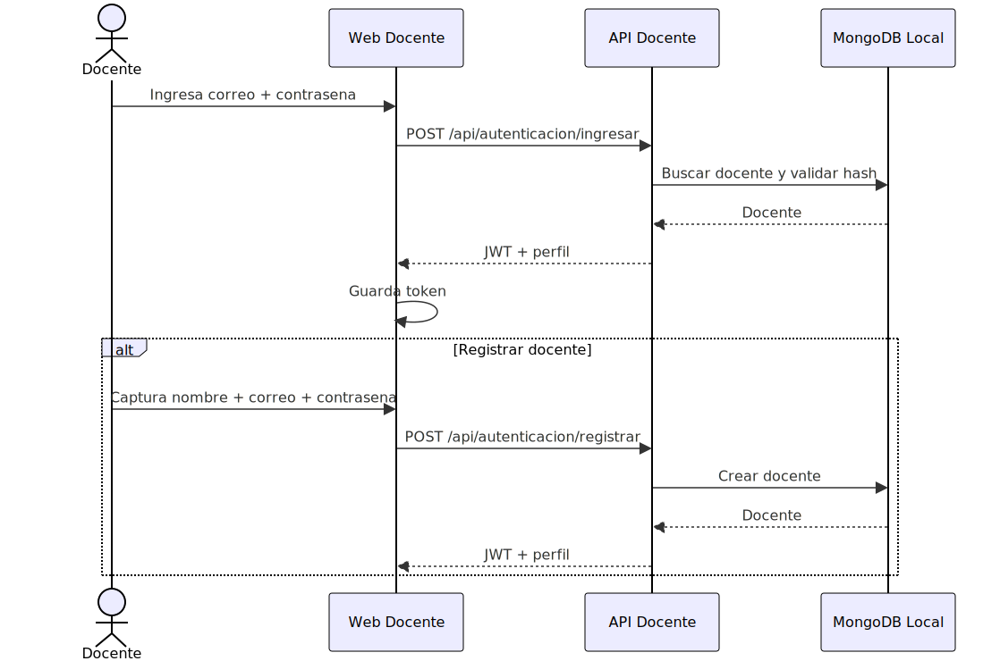
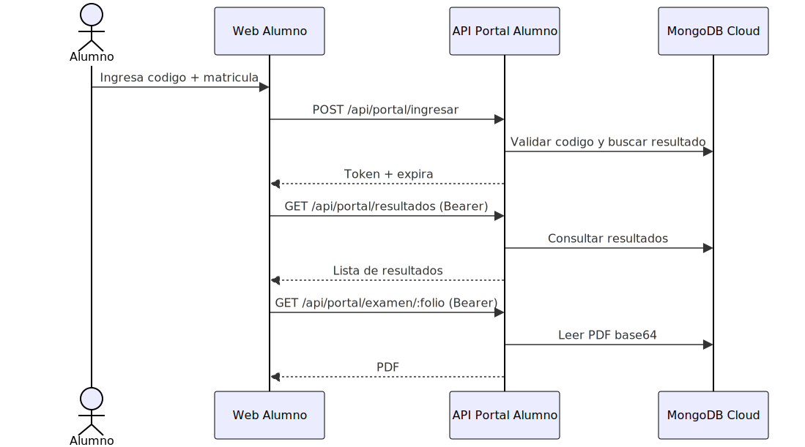

# Diagramas

Este catalogo incluye los diagramas necesarios para entender el sistema end-to-end.

## Arquitectura general

## C4 (contexto, contenedores, componentes)

## Flujos principales

## Modelo de datos (documentos)

## Fuentes Mermaid
- `docs/diagramas/arquitectura/arquitectura-logica.mmd`
- `docs/diagramas/arquitectura/arquitectura-despliegue.mmd`
- `docs/diagramas/c4/arquitectura-c4-context.mmd`
- `docs/diagramas/c4/arquitectura-c4-container.mmd`
- `docs/diagramas/c4/arquitectura-c4-component.mmd`
- `docs/diagramas/flujos/flujo-examen.mmd`
- `docs/diagramas/secuencias/secuencia-login-docente.mmd`
- `docs/diagramas/secuencias/secuencia-publicacion.mmd`
- `docs/diagramas/secuencias/secuencia-portal-alumno.mmd`
- `docs/diagramas/datos/modelo-datos-local.mmd`
- `docs/diagramas/datos/modelo-datos-cloud.mmd`